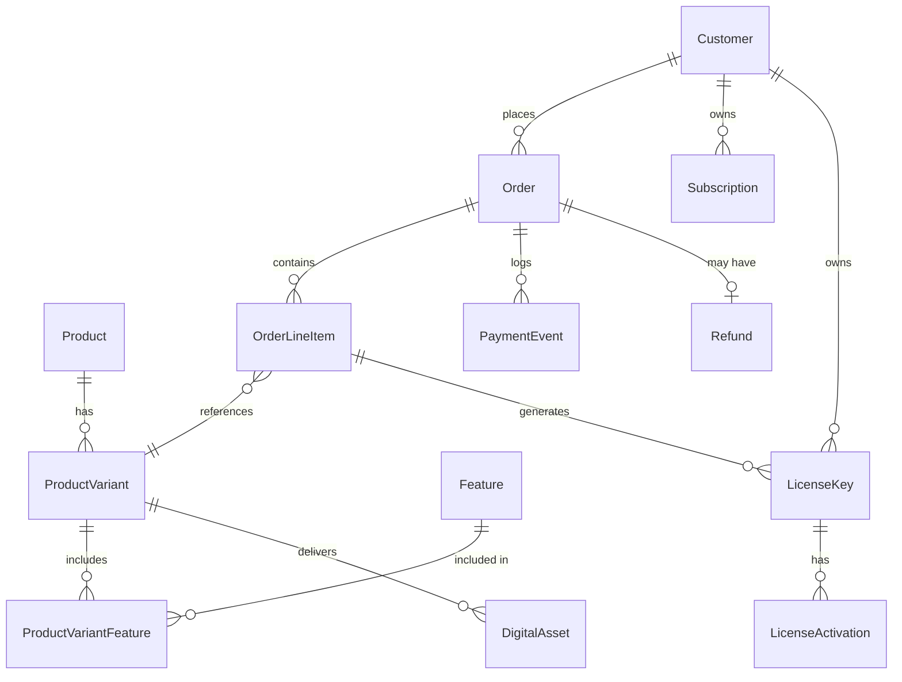

# 03 Data Model

## ER Diagram

## Entity Dictionary

| E-ID | Field | SQL type | Null | Default | Key/FK | Constraint | Why | PII? | Encrypted? |
|---|---|---|---|---|---|---|---|---|---|
| E-03 | Id | uniqueidentifier | N | NEWID() | PK | | Primary identifier | N | N |
| E-03 | CustomerId | uniqueidentifier | N | | FK(Customer) | | Links order to buyer | N | N |
| E-03 | PaddleTransactionId | nvarchar(100) | N | | UQ | | MoR reference | N | N |
| E-03 | TotalAmount | decimal(18,4) | N | | >= 0 | Accurate financials | N | N |
| E-03 | Currency | char(3) | N | 'USD' | | ISO code | N | N |
| E-03 | Status | nvarchar(20) | N | 'Pending' | | State machine | N | N |
| E-03 | CreatedAtUtc | datetime2 | N | GETUTCDATE() | | Standard audit | N | N |
| E-05 | Id | uniqueidentifier | N | NEWID() | PK | | Primary identifier | N | N |
| E-05 | Email | nvarchar(255) | N | | UQ | Valid email | Authentication & Comms | Y | N |
| E-06 | Id | uniqueidentifier | N | NEWID() | PK | | Primary identifier | N | N |
| E-06 | KeyValue | nvarchar(50) | N | | UQ | | The actual license string | N | N |
| E-06 | CustomerId | uniqueidentifier | N | | FK(Customer) | | Owner | N | N |
| E-06 | ProductVariantId | uniqueidentifier | N | | FK(ProductVariant) | | Associated product | N | N |
| E-06 | MaxActivations | int | N | 1 | > 0 | Concurrency control | N | N |
| E-06 | ActiveCount | int | N | 0 | >= 0 | Track usage | N | N |
| E-06 | Status | nvarchar(20) | N | 'Active' | | State machine | N | N |
| E-06 | ExpiresAtUtc | datetime2 | Y | | | Expiry logic | N | N |

*(Drafting key entities, will expand to all 25 in final blueprint)*

## Standard Audit Columns
Every entity includes:
- `CreatedAtUtc` (datetime2)
- `CreatedBy` (nvarchar(100))
- `ModifiedAtUtc` (datetime2, nullable)
- `ModifiedBy` (nvarchar(100), nullable)
- `RowVersion` (timestamp) for concurrency.
*(TenantId is omitted as per A-07 Single-Tenant)*

## Enum Register
- **OrderStatus**: PendingPayment, Paid, Fulfilled, Refunded
- **SubscriptionStatus**: Active, PastDue, Canceled
- **LicenseStatus**: Active, Suspended, Expired

## Index Plan
- `IDX_Customer_Email`: Named query `GetCustomerByEmail` (Auth & Orders)
- `IDX_LicenseKey_KeyValue`: Named query `ValidateLicenseKey` (API Endpoint)
- `IDX_Order_PaddleTransactionId`: Named query `GetOrderByTransaction` (Webhook handler)
- `IDX_LicenseActivation_MachineId`: Named query `CheckMachineActivation`

## Concurrency Strategy
- Optimistic concurrency using `RowVersion` (byte[]) on `LicenseKey` to prevent double-activations and `Order` to prevent double-fulfillment.

## Seed / Master Data
- Initial Admin User (configured via env variables)
- Dummy Category ("Software")

## Volume Estimates (Year 3)
- `Orders`: 17,000 rows (2000 Yr1 + ~15000 Yr3). Minimal footprint.
- `LicenseActivations`: ~50,000 rows.
- `PaymentEvents`: ~100,000 rows (Webhooks are noisy).
- Overall database size easily fits in Azure SQL Basic (2GB) or standard S0 tier.
