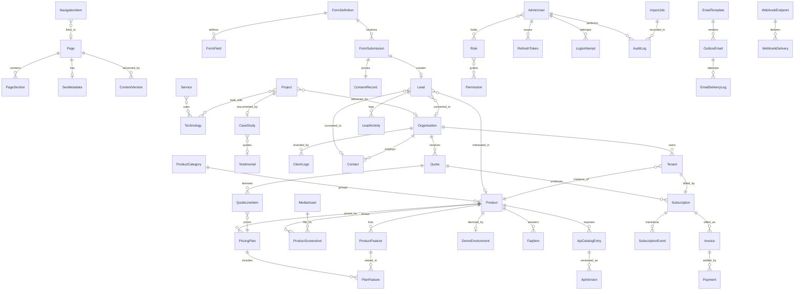

# 03 Data Model

**Standard columns on every entity** (never repeated in the tables below): `Id uniqueidentifier NOT NULL PK DEFAULT NEWSEQUENTIALID()`, `CreatedAtUtc datetime2(3) NOT NULL`, `CreatedBy nvarchar(256) NOT NULL`, `ModifiedAtUtc datetime2(3) NULL`, `ModifiedBy nvarchar(256) NULL`, `RowVersion rowversion NOT NULL` (optimistic concurrency, EX-101). Entities marked **soft-delete** additionally carry `IsDeleted bit NOT NULL DEFAULT 0` and `DeletedAtUtc datetime2(3) NULL` with a global query filter. There is no `TenantId`: the system is single-tenant by A-02.

**Content columns on every publishable entity** (Page, Product, Project, CaseStudy, ApiCatalogEntry): `Slug nvarchar(120) NOT NULL`, `Status tinyint NOT NULL` (0 Draft, 1 Published, 2 Modified, 3 Unpublished, 4 Archived), `PublishedAtUtc datetime2(3) NULL`, `PublishAtUtc datetime2(3) NULL`, `UnpublishAtUtc datetime2(3) NULL`, `SeoMetadataId uniqueidentifier NULL`.

## Entity relationship diagram

## Entity dictionary

Types are SQL Server types. "PII" marks personal data under A-16 and the retention rules of BR-ADM-04. No column in this system needs column-level encryption; secrets (SMTP password, captcha secret, webhook secrets) never live in the database as plaintext - they live in user-secrets or environment variables, except `WebhookEndpoint.SecretHash` which stores only a hash.

### Content

| ID | Entity | Table | Key fields beyond the standard and content columns | PII |
|---|---|---|---|---|
| E-01 | Page | Pages | `Title nvarchar(200) NOT NULL`, `PageType tinyint NOT NULL` (Home, About, Services, Contact, Legal, Custom), `IsSystemPage bit NOT NULL DEFAULT 0` (system pages cannot be deleted), `Body nvarchar(max) NULL`. Unique index on `Slug` where `IsDeleted = 0` (BR-SITE-02). | No |
| E-02 | PageSection | PageSections | `PageId FK NOT NULL`, `SectionType tinyint NOT NULL`, `Heading nvarchar(200) NULL`, `Body nvarchar(max) NULL`, `MediaAssetId FK NULL`, `SortOrder int NOT NULL`, `IsVisible bit NOT NULL DEFAULT 1`. Unique (`PageId`,`SortOrder`). | No |
| E-03 | NavigationItem | NavigationItems | `Menu tinyint NOT NULL` (Header, Footer), `Label nvarchar(80) NOT NULL`, `PageId FK NULL`, `ExternalUrl nvarchar(500) NULL`, `ParentId FK NULL` (one level only, enforced by a check on depth), `SortOrder int NOT NULL`, `OpensInNewTab bit NOT NULL DEFAULT 0`. Check: exactly one of `PageId` / `ExternalUrl` is non-null. | No |
| E-04 | Service | Services | `Name nvarchar(120) NOT NULL`, `Slug nvarchar(120) NOT NULL UNIQUE`, `Summary nvarchar(400) NOT NULL`, `Body nvarchar(max) NULL`, `IconKey nvarchar(60) NULL`, `SortOrder int NOT NULL`, `IsPublished bit NOT NULL DEFAULT 0`. | No |
| E-05 | Technology | Technologies | `Name nvarchar(80) NOT NULL UNIQUE`, `Category tinyint NOT NULL` (Language, Framework, Database, Cloud, Tool), `LogoAssetId FK NULL`, `Proficiency tinyint NULL` (1-5), `SortOrder int NOT NULL`. | No |
| E-06 | ServiceTechnology | ServiceTechnologies | `ServiceId FK`, `TechnologyId FK`. Composite PK. | No |
| E-07 | TeamMember | TeamMembers | `FullName nvarchar(120) NOT NULL`, `RoleTitle nvarchar(120) NOT NULL`, `Bio nvarchar(1000) NULL`, `PhotoAssetId FK NULL`, `LinkedInUrl nvarchar(300) NULL`, `IsPublic bit NOT NULL DEFAULT 1`, `SortOrder int NOT NULL`. | Yes |
| E-08 | Testimonial | Testimonials | `AuthorName nvarchar(120) NOT NULL`, `AuthorRole nvarchar(120) NOT NULL`, `OrganisationId FK NULL`, `Quote nvarchar(1000) NOT NULL`, `HasPermission bit NOT NULL DEFAULT 0` (BR-PRJ-03), `IsPublished bit NOT NULL DEFAULT 0`, `SortOrder int NOT NULL`. | Yes |
| E-09 | MediaAsset | MediaAssets | `FileName nvarchar(260) NOT NULL`, `StorageKey nvarchar(400) NOT NULL UNIQUE`, `ContentType nvarchar(120) NOT NULL`, `SizeBytes bigint NOT NULL`, `Width int NULL`, `Height int NULL`, `AltText nvarchar(300) NULL`, `Sha256 char(64) NOT NULL` (deduplication), `Kind tinyint NOT NULL` (Image, Document, Logo). Check `SizeBytes <= 26214400` (EX-108). | No |
| E-10 | SeoMetadata | SeoMetadata | `MetaTitle nvarchar(60) NOT NULL`, `MetaDescription nvarchar(160) NULL`, `CanonicalUrl nvarchar(500) NULL`, `OgImageAssetId FK NULL`, `NoIndex bit NOT NULL DEFAULT 0`, `JsonLdOverride nvarchar(max) NULL` (BR-SITE-09). | No |
| E-11 | Redirect | Redirects | `FromPath nvarchar(400) NOT NULL UNIQUE`, `ToPath nvarchar(400) NOT NULL`, `StatusCode smallint NOT NULL DEFAULT 301`, `IsAutomatic bit NOT NULL DEFAULT 1`, `HitCount int NOT NULL DEFAULT 0`, `LastHitUtc datetime2(3) NULL`. Check `FromPath <> ToPath` (EX-107). | No |
| E-12 | ContentVersion | ContentVersions | `EntityType nvarchar(60) NOT NULL`, `EntityId uniqueidentifier NOT NULL`, `VersionNumber int NOT NULL`, `SnapshotJson nvarchar(max) NOT NULL`, `PublishedByUserId FK NULL`. Unique (`EntityType`,`EntityId`,`VersionNumber`); the newest 20 are retained (BR-SITE-07). Append-only. | No |
| E-60 | Announcement | Announcements | `Message nvarchar(300) NOT NULL`, `LinkUrl nvarchar(500) NULL`, `StartsAtUtc datetime2(3) NOT NULL`, `EndsAtUtc datetime2(3) NOT NULL`, `Severity tinyint NOT NULL`. Check `EndsAtUtc > StartsAtUtc` (EX-115). | No |

### Catalogue

| ID | Entity | Table | Key fields | PII |
|---|---|---|---|---|
| E-13 | Product | Products | `Name nvarchar(150) NOT NULL`, `Tagline nvarchar(250) NOT NULL`, `Summary nvarchar(1000) NOT NULL`, `Body nvarchar(max) NULL`, `CategoryId FK NOT NULL`, `HeroAssetId FK NULL`, `DocsUrl nvarchar(500) NULL`, `RepositoryUrl nvarchar(500) NULL`, `SortOrder int NOT NULL`, `IsFeatured bit NOT NULL DEFAULT 0`. Unique index on `Slug`; a slug once published is never reused (BR-CAT-07, enforced by a `RetiredSlugs` guard row in Redirects). | No |
| E-14 | ProductCategory | ProductCategories | `Name nvarchar(120) NOT NULL`, `Slug nvarchar(120) NOT NULL UNIQUE`, `Description nvarchar(500) NULL`, `IconKey nvarchar(60) NULL`, `SortOrder int NOT NULL`, `IsPublished bit NOT NULL DEFAULT 0`. | No |
| E-15 | ProductFeature | ProductFeatures | `ProductId FK NOT NULL`, `Name nvarchar(150) NOT NULL`, `Description nvarchar(600) NULL`, `GroupName nvarchar(80) NULL`, `SortOrder int NOT NULL`, `IsHighlighted bit NOT NULL DEFAULT 0`. Unique (`ProductId`,`Name`). | No |
| E-16 | ProductScreenshot | ProductScreenshots | `ProductId FK NOT NULL`, `MediaAssetId FK NOT NULL`, `Caption nvarchar(200) NULL`, `SortOrder int NOT NULL`. Unique (`ProductId`,`SortOrder`). | No |
| E-17 | PricingPlan | PricingPlans | `ProductId FK NOT NULL`, `Name nvarchar(80) NOT NULL`, `Price decimal(18,2) NOT NULL`, `Currency char(3) NOT NULL DEFAULT 'INR'`, `BillingPeriod tinyint NOT NULL`, `IncludedSeats int NOT NULL DEFAULT 1`, `IsFreeTier bit NOT NULL DEFAULT 0`, `IsRecommended bit NOT NULL DEFAULT 0`, `SetupFee decimal(18,2) NOT NULL DEFAULT 0`, `SortOrder int NOT NULL`, `IsPublished bit NOT NULL DEFAULT 0`. Check `Price >= 0` and (`Price > 0 OR IsFreeTier = 1`) (BR-CAT-02). Filtered unique index on (`ProductId`) where `IsRecommended = 1` (BR-CAT-03). | No |
| E-18 | PlanFeature | PlanFeatures | `PricingPlanId FK NOT NULL`, `ProductFeatureId FK NOT NULL`, `Availability tinyint NOT NULL` (Included, Limited, NotIncluded), `LimitValue nvarchar(60) NULL`, `SortOrder int NOT NULL`. Unique (`PricingPlanId`,`ProductFeatureId`). | No |
| E-19 | DemoEnvironment | DemoEnvironments | `ProductId FK NOT NULL UNIQUE`, `Url nvarchar(500) NOT NULL`, `DemoUsername nvarchar(120) NULL`, `DemoPassword nvarchar(120) NULL` (shared demo credential, never logged - BR-CAT-06), `HealthState tinyint NOT NULL DEFAULT 0` (Unknown, Up, Down), `LastCheckedUtc datetime2(3) NULL`, `ConsecutiveFailures int NOT NULL DEFAULT 0`, `IsEnabled bit NOT NULL DEFAULT 1`. | No |
| E-20 | FaqItem | FaqItems | `ProductId FK NULL` (null = site-wide), `Question nvarchar(300) NOT NULL`, `Answer nvarchar(max) NOT NULL`, `SortOrder int NOT NULL`, `IsPublished bit NOT NULL DEFAULT 0`. | No |
| E-21 | ApiCatalogEntry | ApiCatalogEntries | `ProductId FK NULL`, `Name nvarchar(150) NOT NULL`, `Purpose nvarchar(600) NOT NULL`, `BaseUrl nvarchar(500) NULL`, `AuthScheme tinyint NOT NULL` (ApiKey, OAuth2, JwtBearer, None), `DocsUrl nvarchar(500) NULL`, `OpenApiUrl nvarchar(500) NULL`, `HasSandbox bit NOT NULL DEFAULT 0`. | No |
| E-22 | ApiVersion | ApiVersions | `ApiCatalogEntryId FK NOT NULL`, `VersionLabel nvarchar(30) NOT NULL`, `Status tinyint NOT NULL` (Beta, Stable, Deprecated), `ReleasedOn date NOT NULL`, `SunsetDateUtc date NULL`, `ChangelogUrl nvarchar(500) NULL`, `IsCurrent bit NOT NULL DEFAULT 0`. Unique (`ApiCatalogEntryId`,`VersionLabel`); filtered unique on `IsCurrent = 1` per entry (BR-API-02). | No |

### Portfolio

| ID | Entity | Table | Key fields | PII |
|---|---|---|---|---|
| E-23 | Project | Projects | `Title nvarchar(200) NOT NULL`, `OrganisationId FK NULL`, `ClientDisplayName nvarchar(150) NULL`, `Industry nvarchar(80) NOT NULL`, `Summary nvarchar(1000) NOT NULL`, `StartedOn date NOT NULL`, `CompletedOn date NULL`, `ProductId FK NULL`, `CoverAssetId FK NULL`, `IsFeatured bit NOT NULL DEFAULT 0`. Check `CompletedOn IS NULL OR CompletedOn >= StartedOn`. | No |
| E-24 | CaseStudy | CaseStudies | `ProjectId FK NOT NULL UNIQUE`, `Problem nvarchar(max) NOT NULL`, `Approach nvarchar(max) NOT NULL`, `Outcome nvarchar(max) NOT NULL`, `MetricsJson nvarchar(max) NOT NULL` (array of `{label, value, unit}`, at least one entry - BR-PRJ-02), `TestimonialId FK NULL`. | No |
| E-25 | ClientLogo | ClientLogos | `OrganisationId FK NULL`, `DisplayName nvarchar(150) NOT NULL`, `MediaAssetId FK NOT NULL`, `HasPermission bit NOT NULL DEFAULT 0` (BR-PRJ-01), `SortOrder int NOT NULL`. | No |

### Lead capture

| ID | Entity | Table | Key fields | PII |
|---|---|---|---|---|
| E-26 | FormDefinition | FormDefinitions | `Key nvarchar(60) NOT NULL UNIQUE` (contact, request-demo, request-quote, request-tenant, partnership), `Title nvarchar(150) NOT NULL`, `Intro nvarchar(600) NULL`, `SubmitLabel nvarchar(60) NOT NULL`, `SuccessMessage nvarchar(600) NOT NULL`, `ConsentText nvarchar(1000) NOT NULL`, `ConsentVersion int NOT NULL`, `NotifyEmails nvarchar(500) NOT NULL`, `AcknowledgementTemplateId FK NULL`, `IsEnabled bit NOT NULL DEFAULT 1`. | No |
| E-27 | FormField | FormFields | `FormDefinitionId FK NOT NULL`, `Name nvarchar(60) NOT NULL`, `Label nvarchar(120) NOT NULL`, `FieldType tinyint NOT NULL` (Text, Email, Phone, TextArea, Select, Checkbox, ProductPicker), `IsRequired bit NOT NULL DEFAULT 0`, `MaxLength int NULL`, `OptionsJson nvarchar(max) NULL`, `SortOrder int NOT NULL`. Unique (`FormDefinitionId`,`Name`). | No |
| E-28 | FormSubmission | FormSubmissions | `FormDefinitionId FK NOT NULL`, `PayloadJson nvarchar(max) NOT NULL`, `MessageHash char(64) NOT NULL` (BR-LEAD-05), `IpAddress nvarchar(45) NOT NULL`, `UserAgent nvarchar(400) NULL`, `Referrer nvarchar(500) NULL`, `CaptchaOutcome tinyint NOT NULL` (Passed, Failed, Unverified - EX-183), `IsSpam bit NOT NULL DEFAULT 0`, `LeadId FK NULL`. Append-only. Index (`MessageHash`,`CreatedAtUtc`). | Yes |
| E-29 | ConsentRecord | ConsentRecords | `FormSubmissionId FK NOT NULL UNIQUE`, `ConsentText nvarchar(1000) NOT NULL`, `ConsentVersion int NOT NULL`, `Purpose nvarchar(300) NOT NULL`, `GivenAtUtc datetime2(3) NOT NULL`, `IpAddress nvarchar(45) NOT NULL`. Append-only, never edited (A-16). | Yes |
| E-30 | Lead | Leads | `FullName nvarchar(150) NOT NULL`, `Email nvarchar(256) NULL`, `Phone nvarchar(20) NULL`, `CompanyName nvarchar(200) NULL`, `Message nvarchar(4000) NULL`, `ProductId FK NULL`, `Stage tinyint NOT NULL DEFAULT 0` (New, Contacted, Qualified, Converted, Disqualified, Nurturing, Spam, Merged), `DisqualifyReason nvarchar(500) NULL`, `SourceId FK NULL`, `UtmJson nvarchar(1000) NULL`, `OwnerUserId FK NULL`, `FirstResponseAtUtc datetime2(3) NULL`, `SlaDueAtUtc datetime2(3) NOT NULL`, `MergedIntoLeadId FK NULL`, `OrganisationId FK NULL`, `ContactId FK NULL`. Check: `Email IS NOT NULL OR Phone IS NOT NULL` (BR-LEAD-01). Soft-delete. | Yes |
| E-31 | LeadActivity | LeadActivities | `LeadId FK NOT NULL`, `ActivityType tinyint NOT NULL` (Note, Call, EmailOut, EmailIn, Meeting, StageChange, SystemEvent), `Direction tinyint NOT NULL` (Inbound, Outbound, Internal), `Body nvarchar(4000) NULL`, `OccurredAtUtc datetime2(3) NOT NULL`, `FromStage tinyint NULL`, `ToStage tinyint NULL`, `DueAtUtc datetime2(3) NULL`, `IsCompleted bit NOT NULL DEFAULT 0`. Append-only except `IsCompleted`. | Yes |
| E-32 | Organisation | Organisations | `LegalName nvarchar(200) NOT NULL`, `DisplayName nvarchar(200) NOT NULL`, `Gstin char(15) NULL`, `Website nvarchar(300) NULL`, `Industry nvarchar(80) NULL`, `AddressLine1 nvarchar(200) NULL`, `AddressLine2 nvarchar(200) NULL`, `City nvarchar(100) NULL`, `State nvarchar(100) NULL`, `PostalCode nvarchar(12) NULL`, `Country char(2) NOT NULL DEFAULT 'IN'`, `Status tinyint NOT NULL DEFAULT 0` (Prospect, Customer, Inactive). Filtered unique index on `Gstin` where `Gstin IS NOT NULL AND IsDeleted = 0` (BR-CUST-01). Soft-delete. | Yes |
| E-33 | Contact | Contacts | `OrganisationId FK NOT NULL`, `FullName nvarchar(150) NOT NULL`, `Email nvarchar(256) NOT NULL`, `Phone nvarchar(20) NULL`, `JobTitle nvarchar(120) NULL`, `IsPrimary bit NOT NULL DEFAULT 0`, `IsActive bit NOT NULL DEFAULT 1`. Unique (`OrganisationId`,`Email`) (BR-CUST-02). | Yes |
| E-58 | PageViewStat | PageViewStats | `Path nvarchar(400) NOT NULL`, `StatDate date NOT NULL`, `Views int NOT NULL DEFAULT 0`, `UniqueVisitors int NOT NULL DEFAULT 0`, `FormStarts int NOT NULL DEFAULT 0`, `FormSubmits int NOT NULL DEFAULT 0`. Unique (`Path`,`StatDate`). No cookies, no personal identifiers (A-27). | No |

### Sales

| ID | Entity | Table | Key fields | PII |
|---|---|---|---|---|
| E-34 | Quote | Quotes | `QuoteNumber nvarchar(24) NOT NULL UNIQUE` (BR-SALE-01), `OrganisationId FK NOT NULL`, `ContactId FK NOT NULL`, `LeadId FK NULL`, `Status tinyint NOT NULL DEFAULT 0` (Draft, Sent, Accepted, Rejected, Expired, Withdrawn), `Currency char(3) NOT NULL DEFAULT 'INR'`, `SubTotal decimal(18,2) NOT NULL DEFAULT 0`, `DiscountTotal decimal(18,2) NOT NULL DEFAULT 0`, `TaxTotal decimal(18,2) NOT NULL DEFAULT 0`, `GrandTotal decimal(18,2) NOT NULL DEFAULT 0`, `IssuedOn date NULL`, `ValidUntilUtc date NULL`, `Notes nvarchar(2000) NULL`, `RejectReason nvarchar(500) NULL`, `RevisionOfQuoteId FK NULL`, `ApprovedByUserId FK NULL` (BR-SALE-04). | Yes |
| E-35 | QuoteLineItem | QuoteLineItems | `QuoteId FK NOT NULL`, `ProductId FK NOT NULL`, `PricingPlanId FK NULL`, `Description nvarchar(300) NOT NULL`, `Quantity int NOT NULL DEFAULT 1`, `UnitPrice decimal(18,2) NOT NULL`, `DiscountAmount decimal(18,2) NOT NULL DEFAULT 0`, `TaxRatePercent decimal(5,2) NOT NULL DEFAULT 18.00`, `LineTotal decimal(18,2) NOT NULL`, `TaxAmount decimal(18,2) NOT NULL`, `SortOrder int NOT NULL`. Checks: `Quantity > 0`, `UnitPrice >= 0`, `DiscountAmount <= Quantity * UnitPrice` (BR-SALE-03). | No |
| E-36 | Tenant | Tenants | `OrganisationId FK NOT NULL`, `ProductId FK NOT NULL`, `Name nvarchar(150) NOT NULL`, `EnvironmentUrl nvarchar(500) NULL`, `Environment tinyint NOT NULL` (Trial, Staging, Production), `ProvisionedOn date NULL`, `Status tinyint NOT NULL DEFAULT 0` (Requested, Provisioning, Active, Suspended, Ended), `Notes nvarchar(1000) NULL`. Unique (`OrganisationId`,`ProductId`,`Name`). | No |
| E-37 | Subscription | Subscriptions | `TenantId FK NOT NULL UNIQUE`, `PricingPlanId FK NOT NULL`, `QuoteId FK NULL`, `Status tinyint NOT NULL` (Trial, Active, PastDue, Suspended, Cancelled, Expired), `Seats int NOT NULL DEFAULT 1`, `UnitPrice decimal(18,2) NOT NULL`, `Currency char(3) NOT NULL DEFAULT 'INR'`, `BillingPeriod tinyint NOT NULL`, `StartedOn date NOT NULL`, `TrialEndsOn date NULL`, `CurrentPeriodEndsOn date NOT NULL`, `RenewalDate date NOT NULL`, `CancelledOn date NULL`, `CancelReason nvarchar(500) NULL`, `AutoRenew bit NOT NULL DEFAULT 1`. Checks: `Seats > 0`, `CurrentPeriodEndsOn >= StartedOn` (BR-SALE-07, BR-SALE-11). | No |
| E-38 | SubscriptionEvent | SubscriptionEvents | `SubscriptionId FK NOT NULL`, `FromStatus tinyint NULL`, `ToStatus tinyint NOT NULL`, `Reason nvarchar(500) NULL`, `EffectiveOn date NOT NULL`, `TriggeredBy nvarchar(256) NOT NULL`. Append-only. | No |
| E-39 | Invoice | Invoices | `InvoiceNumber nvarchar(24) NOT NULL UNIQUE` (BR-SALE-10), `SubscriptionId FK NULL`, `OrganisationId FK NOT NULL`, `Status tinyint NOT NULL` (Draft, Issued, PartiallyPaid, Paid, Overdue, Cancelled), `IssuedOn date NULL`, `DueDateUtc date NULL`, `SubTotal decimal(18,2) NOT NULL`, `TaxTotal decimal(18,2) NOT NULL`, `GrandTotal decimal(18,2) NOT NULL`, `AmountPaid decimal(18,2) NOT NULL DEFAULT 0`, `PeriodStart date NULL`, `PeriodEnd date NULL`, `CancelReason nvarchar(500) NULL`. Check `AmountPaid <= GrandTotal` (BR-SALE-09). | Yes |
| E-40 | Payment | Payments | `InvoiceId FK NOT NULL`, `Amount decimal(18,2) NOT NULL`, `Mode tinyint NOT NULL` (Upi, NeftRtgs, Cheque, Cash, CardLink, Other), `ReferenceNumber nvarchar(80) NOT NULL`, `ReceivedOn date NOT NULL`, `RecordedByUserId FK NOT NULL`, `IsRefund bit NOT NULL DEFAULT 0`, `Notes nvarchar(500) NULL`. Unique (`InvoiceId`,`ReferenceNumber`) (EX-226). Append-only. | Yes |

### Identity, notification, integration and administration

| ID | Entity | Table | Key fields | PII |
|---|---|---|---|---|
| E-41 | AdminUser | AspNetUsers (extended) | ASP.NET Core Identity columns plus `FullName nvarchar(150) NOT NULL`, `IsActive bit NOT NULL DEFAULT 1`, `DisplayTimeZone nvarchar(60) NOT NULL DEFAULT 'India Standard Time'`, `LastLoginAtUtc datetime2(3) NULL`, `NotifyOnNewLead bit NOT NULL DEFAULT 1`, `NotifyDailyDigest bit NOT NULL DEFAULT 1`. | Yes |
| E-42 | Role | AspNetRoles | Seeded: Owner, Sales, Editor, Auditor (A-13). | No |
| E-43 | Permission | Permissions | `Name nvarchar(80) NOT NULL UNIQUE` in the form `resource:action`, `Description nvarchar(200) NOT NULL`, `Category nvarchar(60) NOT NULL`. Seeded from 06-authz. | No |
| E-44 | RolePermission | RolePermissions | `RoleId FK`, `PermissionId FK`. Composite PK. | No |
| E-45 | RefreshToken | RefreshTokens | `UserId FK NOT NULL`, `TokenHash char(64) NOT NULL UNIQUE`, `ExpiresAtUtc datetime2(3) NOT NULL`, `RevokedAtUtc datetime2(3) NULL`, `ReplacedByTokenHash char(64) NULL`, `CreatedByIp nvarchar(45) NOT NULL`, `RevokedReason nvarchar(200) NULL` (BR-IAM-03). | Yes |
| E-46 | LoginAttempt | LoginAttempts | `EmailAttempted nvarchar(256) NOT NULL`, `Succeeded bit NOT NULL`, `IpAddress nvarchar(45) NOT NULL`, `UserAgent nvarchar(400) NULL`, `FailureReason nvarchar(120) NULL`. Append-only, index (`EmailAttempted`,`CreatedAtUtc`) for BR-IAM-02. | Yes |
| E-47 | EmailTemplate | EmailTemplates | `Key nvarchar(80) NOT NULL UNIQUE`, `Subject nvarchar(300) NOT NULL`, `HtmlBody nvarchar(max) NOT NULL`, `TextBody nvarchar(max) NOT NULL`, `PlaceholdersJson nvarchar(max) NOT NULL`, `Version int NOT NULL DEFAULT 1`, `IsActive bit NOT NULL DEFAULT 1` (EX-264). | No |
| E-48 | OutboxEmail | OutboxEmails | `TemplateKey nvarchar(80) NOT NULL`, `ToAddress nvarchar(256) NOT NULL`, `CcAddress nvarchar(500) NULL`, `Subject nvarchar(300) NOT NULL`, `HtmlBody nvarchar(max) NOT NULL`, `TextBody nvarchar(max) NOT NULL`, `Status tinyint NOT NULL DEFAULT 0` (Pending, Sending, Sent, DeadLettered, Cancelled), `AttemptCount int NOT NULL DEFAULT 0`, `NextAttemptAtUtc datetime2(3) NOT NULL`, `SentAtUtc datetime2(3) NULL`, `LastError nvarchar(1000) NULL`, `CorrelationId uniqueidentifier NOT NULL`, `RelatedEntityType nvarchar(60) NULL`, `RelatedEntityId uniqueidentifier NULL`. Index (`Status`,`NextAttemptAtUtc`) (BR-NOTIF-02). | Yes |
| E-49 | EmailDeliveryLog | EmailDeliveryLogs | `OutboxEmailId FK NOT NULL`, `AttemptNumber int NOT NULL`, `AttemptedAtUtc datetime2(3) NOT NULL`, `SmtpStatusCode nvarchar(20) NULL`, `SmtpResponse nvarchar(1000) NULL`, `Succeeded bit NOT NULL`, `DurationMs int NOT NULL`. Append-only; 12-month retention (S-17, BR-ADM-04). | Yes |
| E-50 | Unsubscribe | Unsubscribes | `EmailAddress nvarchar(256) NOT NULL UNIQUE`, `Reason nvarchar(300) NULL`, `Scope tinyint NOT NULL` (Marketing, All), `TokenHash char(64) NOT NULL`. | Yes |
| E-51 | WebhookEndpoint | WebhookEndpoints | `Name nvarchar(120) NOT NULL`, `Url nvarchar(500) NOT NULL`, `SecretHash char(64) NOT NULL`, `EventsJson nvarchar(500) NOT NULL`, `IsEnabled bit NOT NULL DEFAULT 1`, `LastSuccessAtUtc datetime2(3) NULL`, `ConsecutiveFailures int NOT NULL DEFAULT 0`. | No |
| E-52 | WebhookDelivery | WebhookDeliveries | `WebhookEndpointId FK NOT NULL`, `EventType nvarchar(60) NOT NULL`, `PayloadJson nvarchar(max) NOT NULL`, `Status tinyint NOT NULL` (Pending, Delivered, Failed, Abandoned), `AttemptCount int NOT NULL DEFAULT 0`, `NextAttemptAtUtc datetime2(3) NULL`, `ResponseStatusCode int NULL`, `ResponseBody nvarchar(2000) NULL` (BR-INT-02). | No |
| E-53 | AuditLog | AuditLogs | `OccurredAtUtc datetime2(3) NOT NULL`, `ActorUserId FK NULL`, `ActorEmail nvarchar(256) NULL`, `ActorIp nvarchar(45) NULL`, `Action nvarchar(60) NOT NULL`, `EntityType nvarchar(60) NOT NULL`, `EntityId uniqueidentifier NULL`, `BeforeJson nvarchar(max) NULL`, `AfterJson nvarchar(max) NULL`, `CorrelationId uniqueidentifier NOT NULL`. Append-only, no update or delete path, 7-year retention (BR-ADM-01). | Yes |
| E-54 | SystemSetting | SystemSettings | `Key nvarchar(100) NOT NULL UNIQUE`, `Value nvarchar(max) NULL`, `ValueType tinyint NOT NULL` (String, Int, Bool, Json, Secret), `Category nvarchar(60) NOT NULL`, `IsSecret bit NOT NULL DEFAULT 0` (secret values are stored as a reference to a configuration key, never as plaintext). | No |
| E-55 | Holiday | Holidays | `HolidayDate date NOT NULL UNIQUE`, `Name nvarchar(120) NOT NULL`, `IsRecurring bit NOT NULL DEFAULT 0` (BR-LEAD-10). | No |
| E-56 | ImportJob | ImportJobs | `EntityType nvarchar(60) NOT NULL`, `FileName nvarchar(260) NOT NULL`, `TotalRows int NOT NULL`, `ValidRows int NOT NULL`, `InvalidRows int NOT NULL`, `Status tinyint NOT NULL` (DryRun, Committed, Failed, Cancelled), `ErrorsJson nvarchar(max) NULL`, `SkipInvalid bit NOT NULL DEFAULT 0`, `CommittedAtUtc datetime2(3) NULL` (BR-ADM-02, BR-ADM-03). | No |
| E-57 | ExportJob | ExportJobs | `EntityType nvarchar(60) NOT NULL`, `FilterJson nvarchar(max) NULL`, `Format tinyint NOT NULL` (Csv, Xlsx), `RowCount int NOT NULL`, `StorageKey nvarchar(400) NULL`, `ExpiresAtUtc datetime2(3) NOT NULL`, `Status tinyint NOT NULL`. | No |
| E-59 | ScheduledJobRun | ScheduledJobRuns | `JobName nvarchar(80) NOT NULL`, `StartedAtUtc datetime2(3) NOT NULL`, `FinishedAtUtc datetime2(3) NULL`, `Succeeded bit NULL`, `ItemsProcessed int NOT NULL DEFAULT 0`, `Error nvarchar(2000) NULL`. Index (`JobName`,`StartedAtUtc`). | No |

## Index plan

No index exists without a named query.

| Index | Table | Columns | The query it serves |
|---|---|---|---|
| IX_Pages_Slug | Pages | `Slug` (filtered `IsDeleted = 0`) unique | Public page lookup by URL |
| IX_Pages_Status_Publish | Pages | `Status, PublishAtUtc` | Scheduler sweep for due publishes |
| IX_Products_Slug | Products | `Slug` unique | Public product page |
| IX_Products_Status_Category | Products | `Status, CategoryId, SortOrder` | Public catalogue listing and filtering |
| IX_PricingPlans_Product | PricingPlans | `ProductId, IsPublished, SortOrder` | Plan table on the product page and "from Rs. X" (BR-CAT-05) |
| IX_Leads_Stage_Created | Leads | `Stage, CreatedAtUtc DESC` (filtered `IsDeleted = 0`) | Lead inbox default view |
| IX_Leads_SlaDue | Leads | `SlaDueAtUtc` (filtered `FirstResponseAtUtc IS NULL`) | SLA breach sweep and dashboard counter |
| IX_Leads_Email | Leads | `Email` | Duplicate detection (BR-CUST-04) |
| IX_Leads_Owner_Stage | Leads | `OwnerUserId, Stage` | "My open leads" |
| IX_LeadActivities_Lead | LeadActivities | `LeadId, OccurredAtUtc DESC` | Lead timeline |
| IX_FormSubmissions_Hash | FormSubmissions | `MessageHash, CreatedAtUtc` | Double-submit detection (BR-LEAD-05) |
| IX_FormSubmissions_Ip | FormSubmissions | `IpAddress, CreatedAtUtc` | Rate limiting and abuse review (BR-LEAD-04) |
| IX_Quotes_Org_Status | Quotes | `OrganisationId, Status` | Quotes for a customer |
| IX_Quotes_ValidUntil | Quotes | `ValidUntilUtc` (filtered `Status = Sent`) | Expiry sweep (BR-SALE-02) |
| IX_Subscriptions_Renewal | Subscriptions | `RenewalDate` (filtered `Status IN (Trial, Active, PastDue)`) | Renewal reminders and the renewals-due report |
| IX_Invoices_Status_Due | Invoices | `Status, DueDateUtc` | Overdue sweep and ageing report |
| IX_OutboxEmails_Pending | OutboxEmails | `Status, NextAttemptAtUtc` | Outbox pump |
| IX_AuditLogs_Entity | AuditLogs | `EntityType, EntityId, OccurredAtUtc DESC` | "What happened to this record" |
| IX_AuditLogs_Occurred | AuditLogs | `OccurredAtUtc DESC` | Audit viewer and retention sweep |
| IX_PageViewStats_Date | PageViewStats | `StatDate, Path` unique | Traffic and funnel reports |
| FT_Products | Products | full-text on `Name, Tagline, Summary, Body` | Public product search |
| FT_Leads | Leads | full-text on `FullName, CompanyName, Message` | Admin lead search |

## Concurrency and sequences

Optimistic concurrency everywhere through `RowVersion`; a conflict returns 409 with the current values rather than overwriting (EX-101). Gapless numbering for quotes and invoices uses a `NumberSequences` table (`Key, FinancialYear, NextValue`) updated with `UPDATE ... WITH (UPDLOCK, ROWLOCK)` inside the same transaction that inserts the document, so a rollback never burns a number and two concurrent creates never collide (BR-SALE-01, EX-221). Identity columns are never used for a customer-visible number.

## Seed and master data

Seeded through EF Core `HasData` with fixed GUIDs and fixed timestamps so migrations are deterministic: the four roles, the full permission catalogue from 06-authz, the Owner user (email and password supplied through user-secrets at first run, never in the migration), the five form definitions with their fields and consent text, the email templates, the system pages (home, about, services, contact, privacy, terms) as drafts, product categories for the five known verticals, and the Indian national holidays for the current year.

## Volume estimates and reconciliation

| Entity | Year 1 | Year 3 | Growth driver |
|---|---|---|---|
| Lead / FormSubmission / ConsentRecord | 2,000 | 15,000 | A-10, A-11 |
| LeadActivity | 8,000 | 60,000 | ~4 per lead |
| Organisation / Contact | 300 / 500 | 2,000 / 3,500 | conversions |
| Quote / QuoteLineItem | 300 / 900 | 2,500 / 7,500 | A-10 |
| Tenant / Subscription | 60 | 300 | A-10, A-11 |
| Invoice / Payment | 500 / 600 | 4,000 / 5,000 | monthly and yearly billing |
| Content items (pages, products, projects, API entries) | 400 | 1,500 | A-10 |
| MediaAsset | 2,000 | 10,000 | screenshots and logos |
| ContentVersion | 4,000 | 25,000 | 20 kept per item (BR-SITE-07) |
| OutboxEmail / EmailDeliveryLog | 12,000 / 20,000 | 90,000 / 150,000 | acknowledgements, alerts, digests |
| AuditLog | 40,000 | 300,000 | every mutation |
| PageViewStat | 15,000 | 60,000 | routes x days |

Total year-3 row count is under 1 million and the largest table is `AuditLog`; a single SQL Server instance with the indexes above is comfortably sufficient (NFR-DATA-02).

**Two-way reconciliation.** Every entity in this dictionary is touched by at least one REQ row in `04-requirements.md`, and every entity named in a REQ row's "Entities Touched" column appears in this dictionary. The check is mechanical, not a claim: `node scripts/gate-h.mjs` (kept in `_research/` during Stage A) parses both files and fails on any orphan in either direction. Its output is pasted in `10-verification-log.md`.
